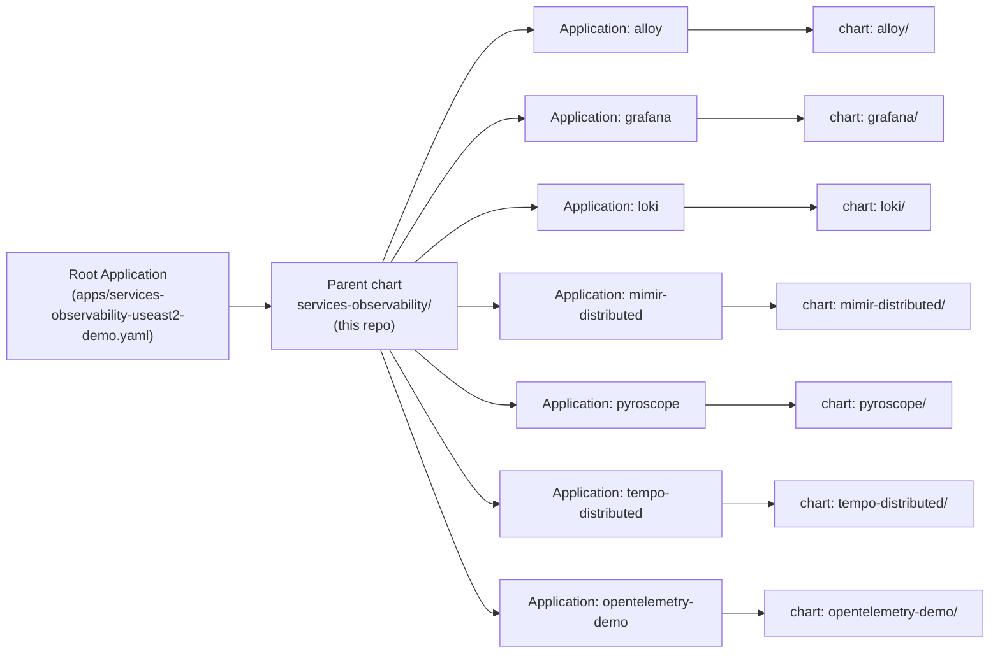

# Architecture

## App-of-Apps flow

## Per-env diff

| Knob | `values-useast2-demo.yaml` | `values-uswest2-demo.yaml` |
|------|----------------------------|----------------------------|
| `region` | `us-east-2` | `us-west-2` |
| `server` | `<useast2 EKS endpoint>` | `<uswest2 EKS endpoint>` |
| S3 buckets | `acme-*-us-east-2-demo` | `acme-*-us-west-2-demo` |
| `applicationBlacklist` | `[]` | `[opentelemetry-demo, pyroscope]` |

Same templates, different DNA.
